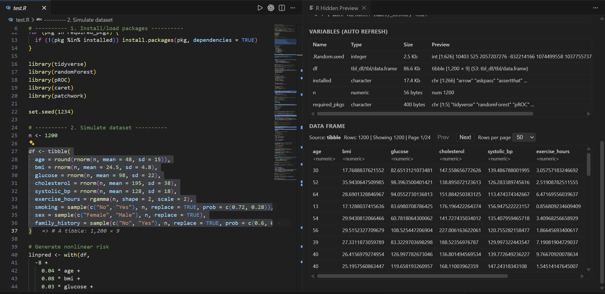
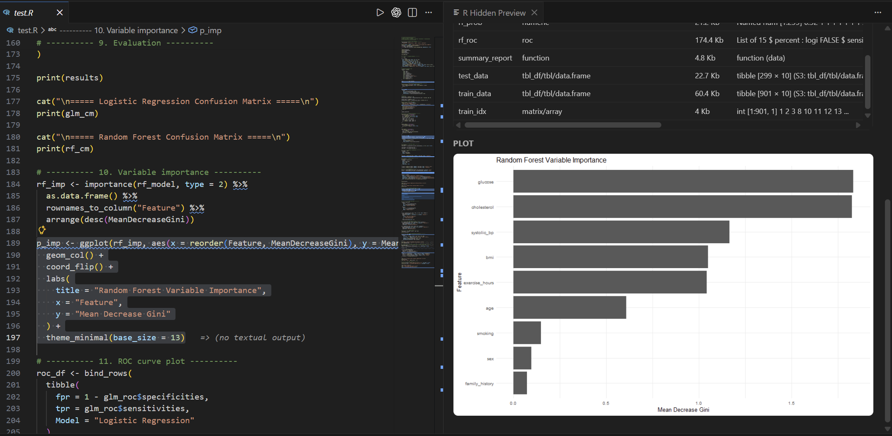

# R Instant Preview

Like Jupyter Notebook — but inside .R files

> **Select R code → See results instantly in VS Code**  
> No clicking "Run". No context switching. Notebook-style R feedback, directly in your editor.

R Instant Preview turns VS Code into an interactive R workspace: select code, execute instantly, and see output inline plus in a rich preview panel. It is built for data exploration, teaching, analysis, and rapid prototyping.

Quick Open: **Ctrl+Shift+P** -> **R Instant Preview: Open Preview Panel**

---

## 🚀 Key Features

| Feature | Benefit |
|---------|---------|
| **Auto-Execute on Select** | No run button clicks—just select code and see output |
| **Inline + Detail Preview** | One-line summary plus full panel output for fast feedback and deep inspection |
| **Plot Rendering** | Generated plots display as PNG images automatically |
| **Data Frame Tables** | View data.frame and tibble results as scrollable HTML tables |
| **Smart Context** | Intelligently infers upstream variable dependencies (no manual setup needed) |
| **Persistent + Incremental Session** | Reuses R state and re-runs only changed blocks for better speed |
| **Safety Rules** | Blocks dangerous functions by default (read/write files, system calls, package installs) |
| **Missing Package Detection** | Auto-detects and prompts one-click installation of missing packages |

---

## 🎯 Who Should Use This?

- **Data Scientists & Analysts** – Explore data and test hypotheses interactively
- **Students & Educators** – Teach R with instant visual feedback
- **Notebook Enthusiasts** – Want Jupyter-style experience in VS Code
- **RStudio Users Migrating to VS Code** – Familiar real-time workflow
- **Statisticians** – Quick validation of calculations and models

---

## 🎥 Screenshots

### 1) Data Frame + Variables Auto Refresh

Shows the side-by-side workflow: select R code on the left, and instantly preview variables plus data frame output on the right.



### 2) Plot Preview in Panel

Demonstrates automatic plot rendering in the preview panel (no manual Run step needed).



---

## ⚡ Getting Started

### Requirements
- **VS Code** 1.90.0 or newer
- **R** 3.5.0 or newer
- **Rscript** in PATH (macOS/Linux) or auto-detected (Windows)

### Installation & Setup

1. **Install the Extension**  
   Open VS Code and search for "R Instant Preview" in Extensions (or click install from Marketplace)

2. **Verify R Installation**
   ```bash
   # Check R is accessible:
   which Rscript     # macOS/Linux
   where Rscript     # Windows
   
   # Check R version:
   R --version
   ```

3. **Configure (Optional)**  
   If `Rscript` is not in PATH, set it in VS Code settings:
   ```json
   {
     "rHiddenPreview.rscriptPath": "/usr/local/bin/Rscript"
   }
   ```

4. **Open an R File**  
   Create or open any `.R` file and start selecting code!

### Basic Workflow

```
1. Open .R file
2. Select any code (mouse or keyboard)
3. Wait ~350ms debounce
4. Results appear inline + in preview panel
5. Open full panel: Ctrl+Shift+P → "R Instant Preview: Open Preview Panel"
```

---

## 🧠 Execution Context Modes

The extension supports three execution strategies:

### 1. **Selection Only** (Strictest)
```json
"rHiddenPreview.contextMode": "selectionOnly"
```
Runs *only* the selected code, nothing else. Best for safety.

```r
# Setup code (won't execute)
x <- 1:10

# Select only this:
mean(x)  # ✅ Executes, but x is undefined → error

# Lesson: Use selectionOnly when you want minimal side effects
```

### 2. **Document Before Selection** (Default / Balanced)
```json
"rHiddenPreview.contextMode": "documentBeforeSelection"
```
Runs all code from file start → selection start, then selected code. Most practical for typical workflows.

```r
# This code runs first:
x <- 1:10
y <- x * 2

# Select this:
mean(y)  # ✅ Works! Has access to x and y
```

### 3. **Smart Context** (Minimum Dependencies / Intelligent)
```json
"rHiddenPreview.contextMode": "smartContext"
```
**Advanced**: Static analysis identifies *only the minimal upstream variables* your selection depends on. Ignores unrelated code.

```r
# Unrelated setup:
a <- 100
b <- 200
write_output <- function(x) { ... }  # Side effects

# Relevant setup:
x <- 1:10
y <- x * 2

# Select this:
mean(y)

# Smart context executes: x <- 1:10, y <- x * 2, then selection
# (skips a, b, write_output function)
```

**How it works:**
- **Static Analysis**: Parses your R code and builds a dependency graph
- **Runtime Validation**: Executes minimal code; if it fails (missing variable), falls back to wider context automatically
- **Incremental Execution**: Caches previous blocks by hash; reuses unchanged blocks; only re-runs modified code
- **Safety First**: Only auto-executes code passing safety rules (see Safety section)

---

## 🎨 Display Results

### Inline Results (End-of-Line)
```
sum(1:5)  # → [1] 15
```
Quick one-line summary visible immediately without opening panels.

### Detail Panel
Open with: `Ctrl+Shift+P` → `R Instant Preview: Open Preview Panel`

The panel displays:
- **Text Output** - Full captured stdout
- **Plots** - Rendered as PNG images
- **Data Frames** - Scrollable HTML tables with sorting
- **Errors** - Full error messages for debugging
- **Variables** - Live `.GlobalEnv` variables with types

---

## 🔒 Safety & Execution Rules

**This extension automatically executes R code.** Read this section carefully.

### What Gets Auto-Executed?

By default, only "safe" code auto-executes:

✅ **Auto-executed (safe by default):**
```r
mean(x)
plot(y ~ x, data = df)
subset(df, age > 18)
sum(1, 2, 3)
```

❌ **Blocked (safe mode prevents auto-execution):**
```r
read.csv("sensitive_file.csv")
write.csv(df, "output.csv")
install.packages("ggplot2")
system("rm -rf /")  # Never!
download.file(...)
setwd("/new/path")
```

### Configure Safety Rules

```json
{
  "rHiddenPreview.safeAutoExecutionOnly": true,  // Default: block unsafe code
  "rHiddenPreview.safeFunctionBlacklist": [
    "read.csv", "write.csv", "install.packages", "system"
  ],
  "rHiddenPreview.safeFunctionWhitelist": []  // Leave empty to allow all safe code
}
```

### Whitelist Mode (Advanced)

If you set `safeFunctionWhitelist` to non-empty, *only listed functions* are allowed:

```json
{
  "rHiddenPreview.safeFunctionWhitelist": ["mean", "sd", "plot", "summary"]
}
```
Now only code using `mean()`, `sd()`, etc. auto-executes. Everything else is blocked.

### Side Effects Warning

- **Selected code executes automatically** when you change selection
- **In documentBeforeSelection mode**, code before your selection also runs
- **Any code may have side effects**: file writes, network calls, console output, graphics output, state mutation
- **Recommend**: Use trusted workspaces; start with `selectionOnly` mode if unsure

### Best Practices

1. ✅ **Use Trusted Workspaces Only** – Mark your project as trusted in VS Code
2. ✅ **Start with selectionOnly** – Then upgrade to wider modes as needed
3. ✅ **Review Blacklist** – Verify default blocked functions match your needs
4. ✅ **Keep Sessions Clean** – Save state (environment) between sessions to avoid surprises
5. ✅ **Monitor Output** – Watch the R Hidden Preview output channel for execution logs

---

## ⚙️ Configuration

### Core Settings

```json
{
  // Path to Rscript executable (auto-detected if in PATH)
  "rHiddenPreview.rscriptPath": "Rscript",

  // Execution timeout (ms)
  "rHiddenPreview.timeoutMs": 3000,

  // Debounce delay before executing selection (ms)
  "rHiddenPreview.debounceMs": 350,

  // Auto-execute on selection change
  "rHiddenPreview.autoPreview": true,

  // Enable hover-based quick preview
  "rHiddenPreview.enableHoverPreview": false,

  // Execution context mode: "selectionOnly", "documentBeforeSelection", "smartContext"
  "rHiddenPreview.contextMode": "documentBeforeSelection",

  // Only auto-execute code passing safety rules
  "rHiddenPreview.safeAutoExecutionOnly": true,

  // Max output length before truncation (chars)
  "rHiddenPreview.maxOutputLength": 2000,

  // Show inline end-of-line results
  "rHiddenPreview.showInlinePreview": true,

  // Show detail preview panel
  "rHiddenPreview.showPanelPreview": true,

  // Require workspace trust before auto-execution
  "rHiddenPreview.requireWorkspaceTrust": true,

  // Ignore incomplete selections (heuristic check)
  "rHiddenPreview.ignoreIncompleteSelection": true
}
```

### Safety Settings

```json
{
  // Custom blocked function list
  "rHiddenPreview.safeFunctionBlacklist": [
    "read.csv", "read.table", "write.csv", "install.packages",
    "system", "system2", "shell", "setwd", "unlink"
  ],

  // Whitelist (if non-empty, only these functions auto-execute)
  "rHiddenPreview.safeFunctionWhitelist": []
}
```

---

## 🐛 Troubleshooting

### Rscript Not Found

**Error:** `Rscript executable not found`

**Solutions:**
1. Check R is installed: `R --version`
2. Add `Rscript` to PATH (see OS docs)
3. Or set full path in settings:
   ```json
   {
     "rHiddenPreview.rscriptPath": "C:\\Program Files\\R\\R-4.4.1\\bin\\Rscript.exe"
   }
   ```

### No Output Appears

**Checklist:**
- ✅ `autoPreview` is `true`
- ✅ `showInlinePreview` or `showPanelPreview` is `true`
- ✅ Workspace is trusted (if `requireWorkspaceTrust` is `true`)
- ✅ R code is complete (not inside unclosed brackets/quotes)

### Timeout / Slow Performance

**Solutions:**
- Increase `timeoutMs`: `"rHiddenPreview.timeoutMs": 5000`
- Use `smartContext` mode to reduce execution scope
- Use `selectionOnly` for faster feedback on unrelated code
- Check R session for hanging operations

### Variable Not Found

**Error:** `object 'x' not found`

This means your selection depends on variables not in the current execution context:

- **Switch to documentBeforeSelection** mode (default is safer)
- Or manually include the variable definitions in your selection
- Or use smartContext mode (auto-finds dependencies)

---

## 📝 License

MIT

## 🤝 Contributing

Issues, feature requests, and PRs welcome on GitHub!

**Report bugs:** [GitHub Issues](https://github.com/linxiangsun145/r-hidden-preview)  
**Contribute code:** [GitHub PRs](https://github.com/linxiangsun145/r-hidden-preview)

---

**Enjoy interactive R development! 🎉**
